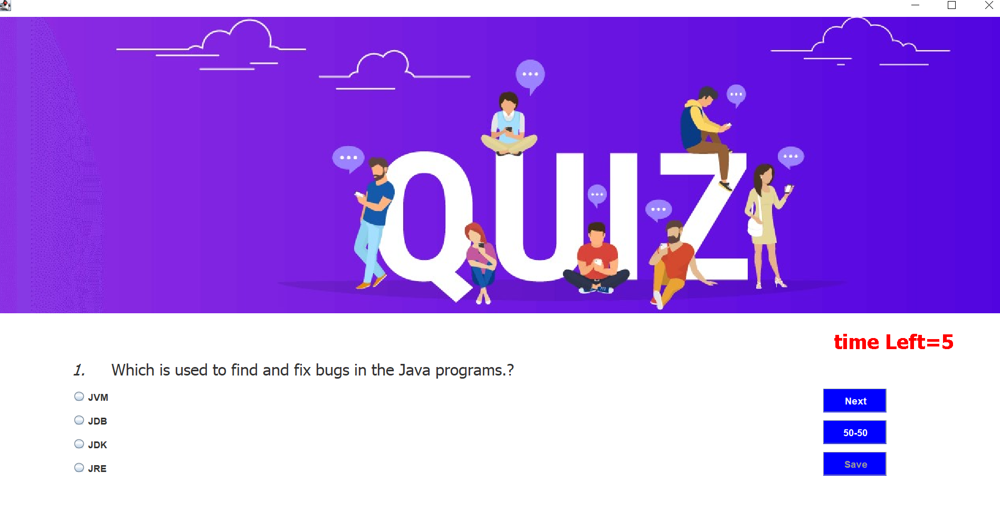
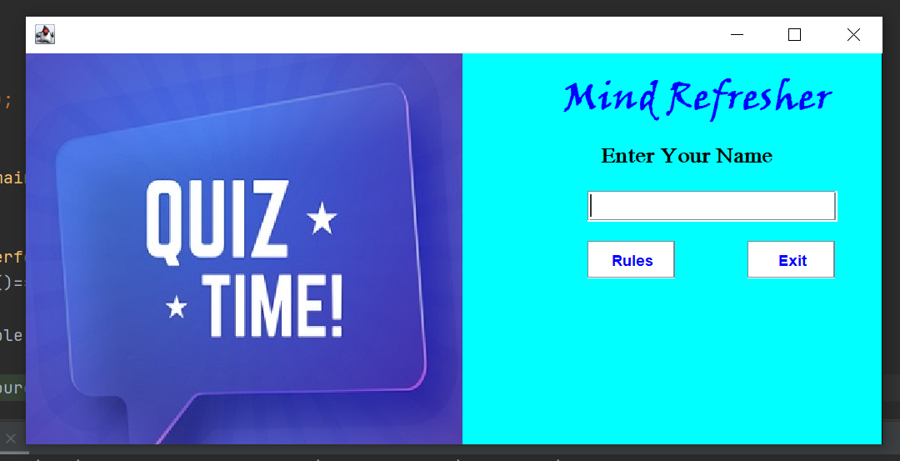
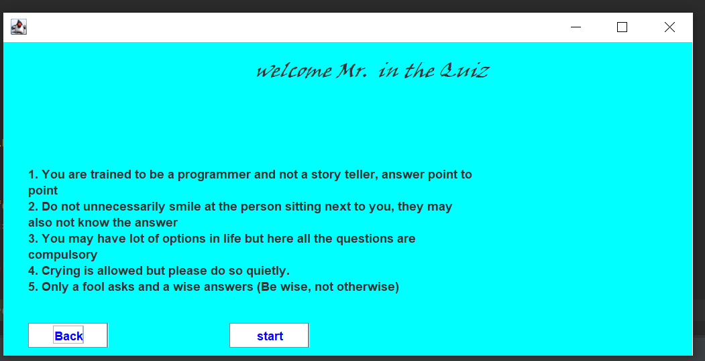

# java-chat
that is basically ajava chat app made by using the java language with the client server logic in which two poerson can talsk yo each other and cann raed another message and send to another simultaneiusly
<h1>BELOW IS THE SS FROM THE PROJECT</h1>

